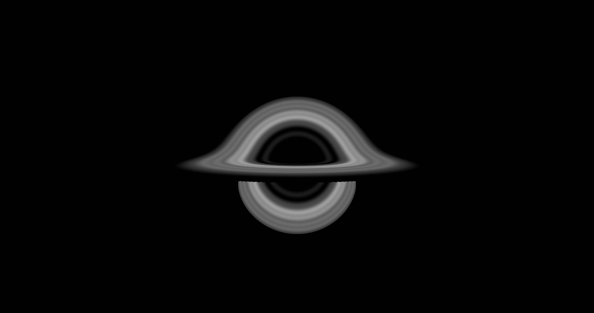
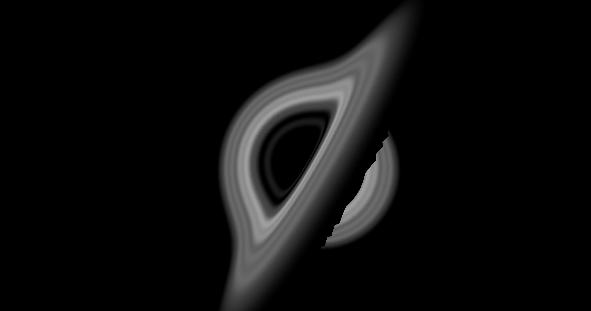
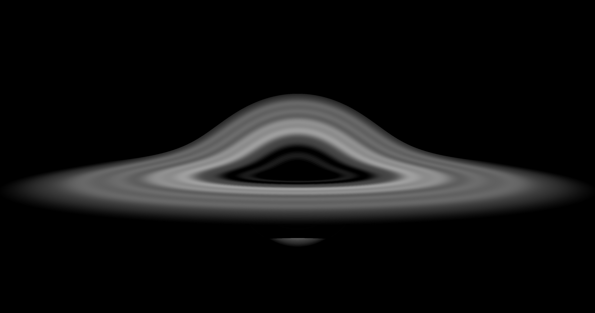

# Black Hole Raytracer

# Usage

First you need to setup a simulation configuration. This is done by editing or created a `simulation.json` file. The file contains the following fields:

-   pixelSize: The size of a pixel in the image. `ex: 1`
    -   Larger pixels size will result in a lower image quality but a much faster render time
-   outputPath: The path to the output image. `ex: './images'`
-   blackHoleSize: The size of the black hole in the simulation. `ex: 200`
-   raysPerPixel: The number of rays to trace per pixel. `ex: 200`
-   dt: The step size of the simulation. `ex 10`
    -   Larger or smaller step sizes may result in artifacts
-   engine: The engine to use. `ex: 'accurate'`
    -   'accurate' uses a more accurate but slower engine
    -   If no engine is specified, the default engine is used
-   size: The width and height of the simulation. `ex: [400, 400]`
-   camera: If provided, creates a static position for the camera in the scene. `ex: [0, -1, -10]`
-   direction: If provided, creates a static direction for the camera in the scene. `ex: [120, 0]`
-   path: If provided, creates a linear interpolated position and direction for the camera in the scene.

Once a simulation is created, run the following command to start the simulation: `node .`
It will show you the progress of the simulation and the output images will be generated in the output path.

# Processing

You can process the image files into a video using the `process.py` file. It takes the following arguments:

-   --framerate: The framerate of the video. `ex: 30`
-   --images: The path to the images to process. `ex: './images'`
-   --output: The path to the output video. `ex: './output'`
-   --autoplay: If true, the video will autoplay.

You can then run the processor with the following command: `python process.py <arguments>`

# Installing

To install the dependencies for the processor, run the following command:
`pip3 install -r requirements.txt`

# LICENSE

See the [LICENSE](LICENSE.md) file for the license.

# Author

Created by @nekumelon

